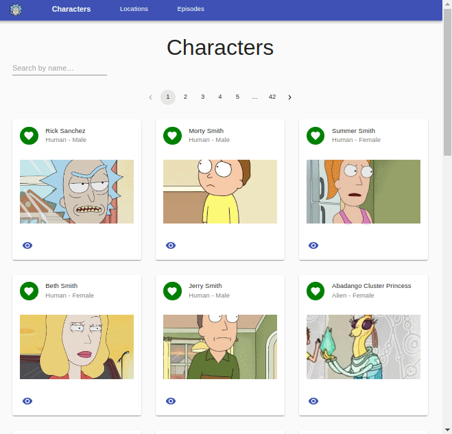
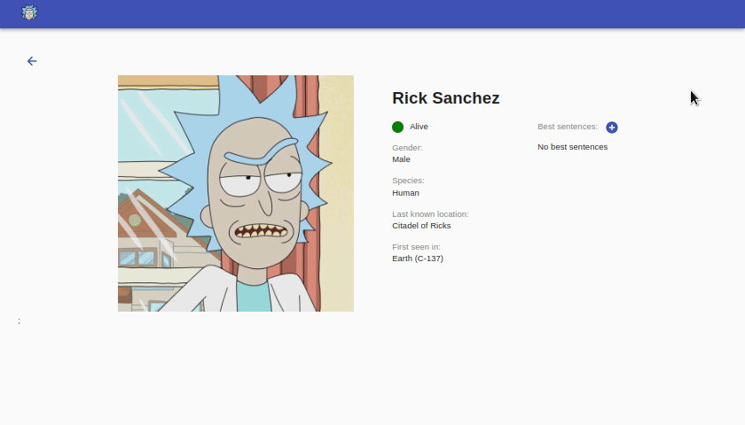

# Lemoncode Module 6 - Rest API

In this repository, it has been made the exercises of module 6 Rest API.

The following gif shows the final state of the application after doing all the proposed exercises.

All the proposed exercises have been completed. A branch has been created for each exercise, in addition a PR has been created for each one.

Run "npm install" and "npm start". Then, navigate to http://localhost:8080/.

From the toolbar you can access the different lists: characters, locations and episodes.

## Exercise 1:

It consists of creating a project where the Rick & Morty Rest API is consulted to display a list of characters. In this case, I have used Axios.

Each character card has an eye button that allows access to the character detail, where more information is displayed.

## Exercise 2:

The project is modified and json-server is used to be able to add the best sentences for each character. This can be done from the detail page of each character.

## Optional exercise:

Exercise 1 has been implemented but using the GraphQL API.

## Challenge Exercise:

Some proposed improvements are added:

- Pagination
- Searcher
- Implement list of characters, locations and episodes.
